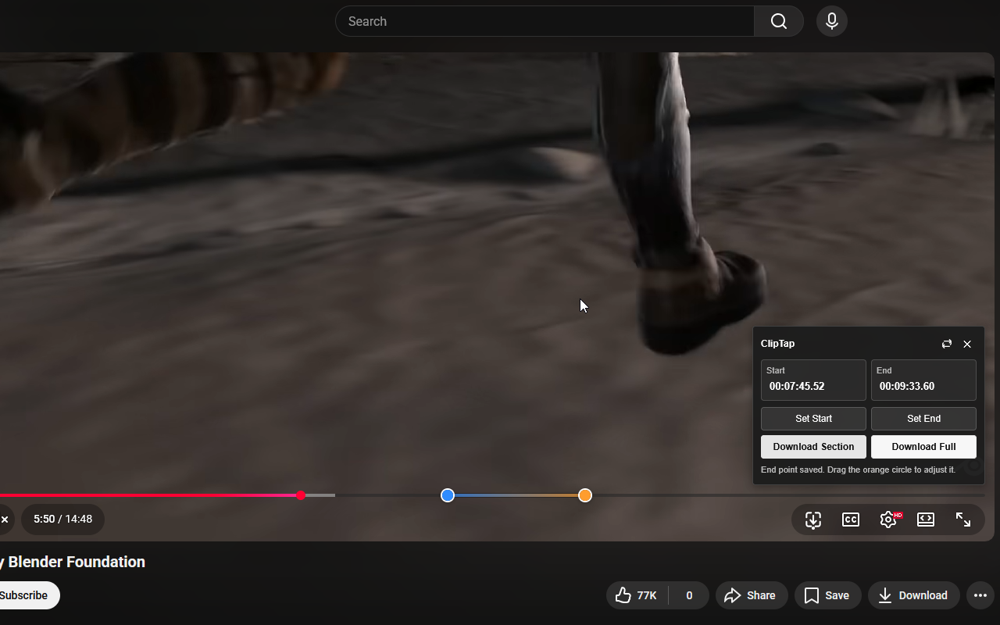
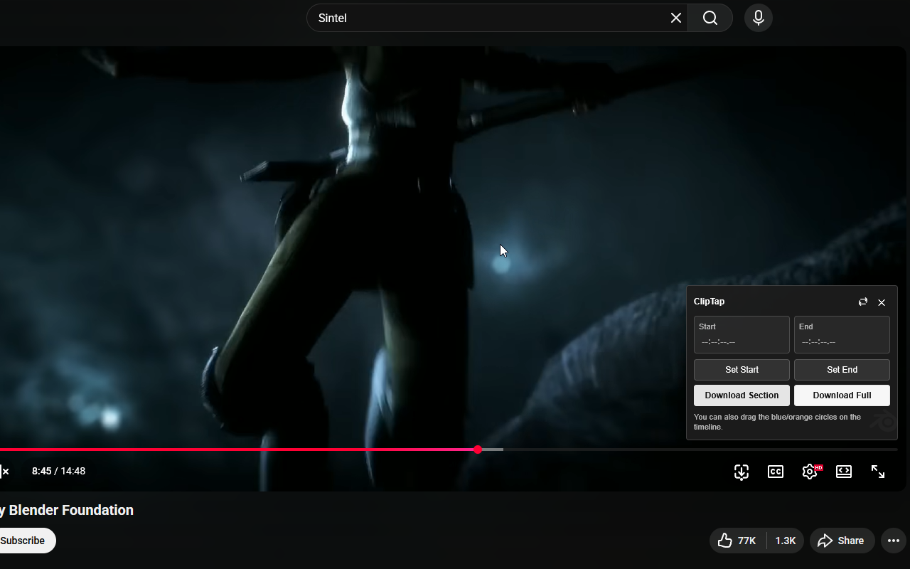
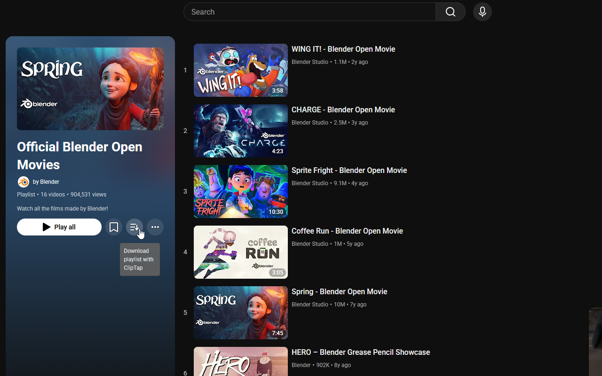
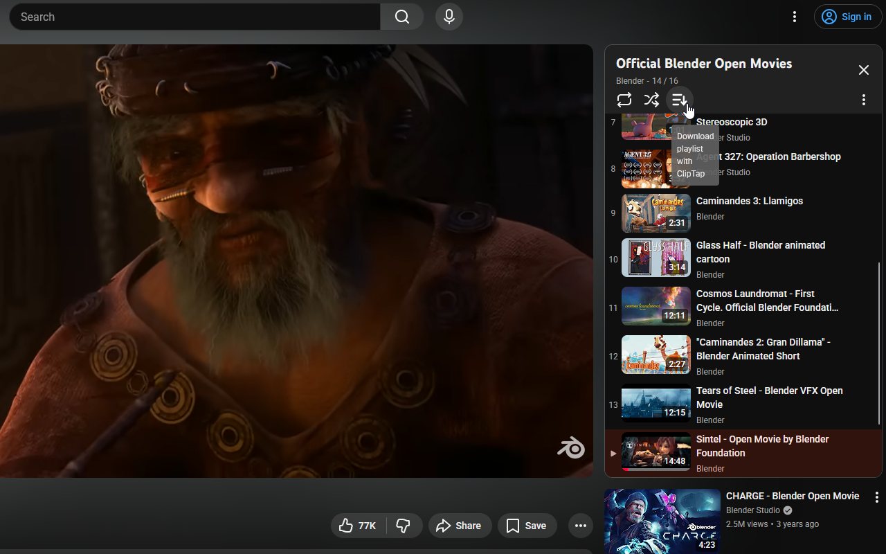
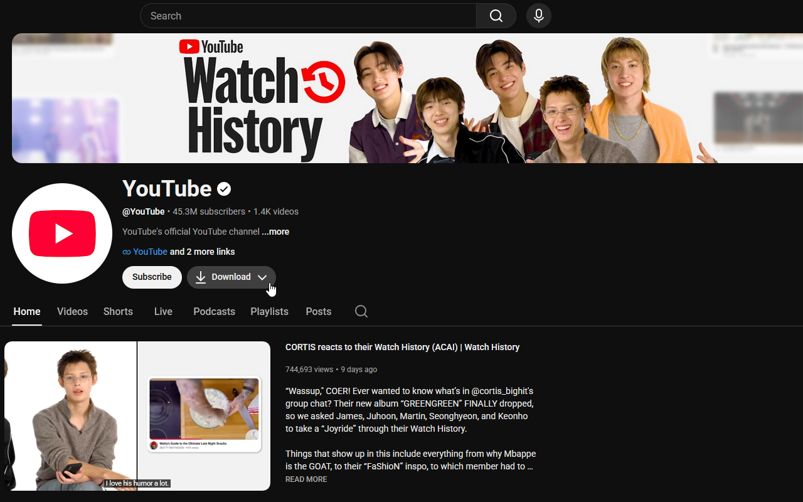
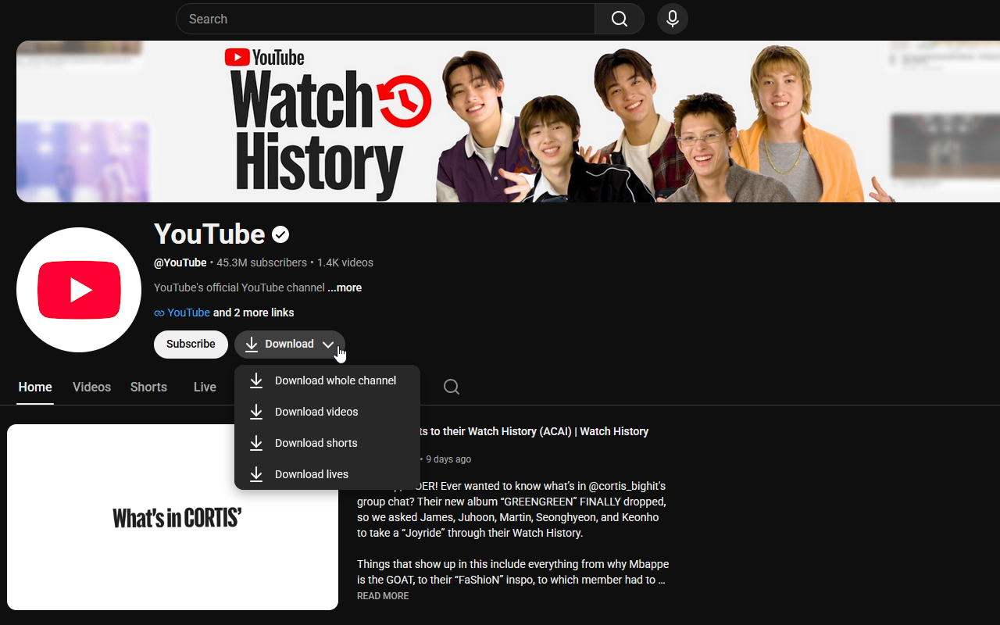
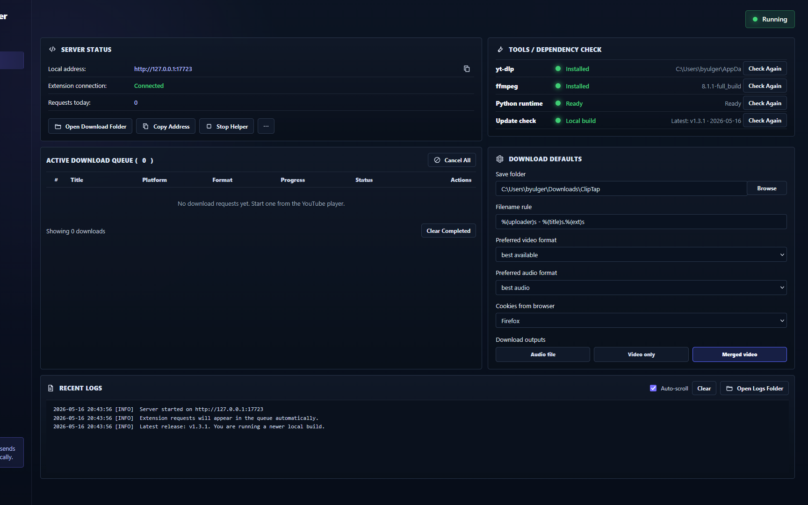
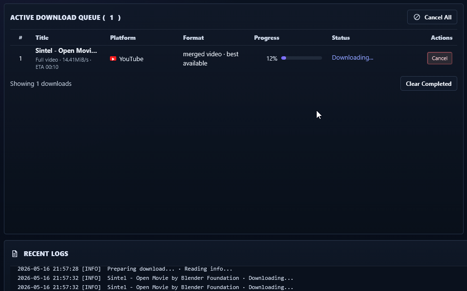
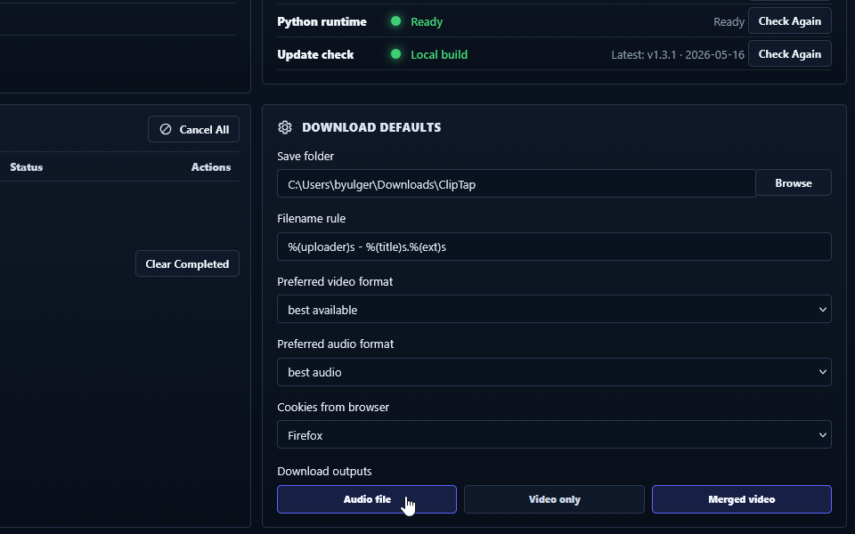
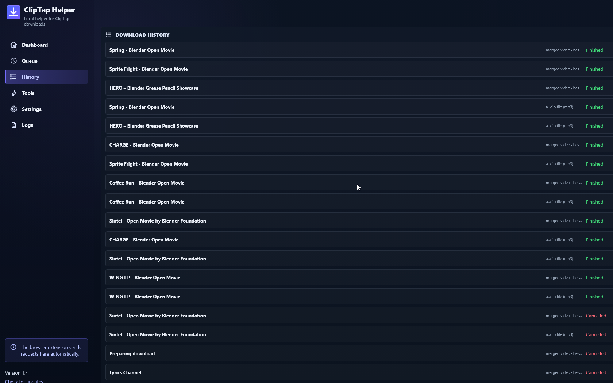

# ClipTap

ClipTap is a local-first YouTube downloader that combines a browser extension with a local Helper manager. It adds native-style controls to YouTube so you can save full videos, selected video sections, playlists, and channels while keeping the actual download work on your own computer.



## What ClipTap can do

- Download a selected section from a YouTube video.
- Download the full current video.
- Set start and end points from the current playback position.
- Fine-tune the range by dragging blue/orange handles directly on the YouTube timeline.
- Type exact timestamps, including decimal seconds.
- Download YouTube playlists from playlist pages and watch pages with playlist panels.
- Download YouTube channels by scope: whole channel, videos, shorts, or lives.
- Choose which output files to create from the Helper defaults:
  - audio file
  - video-only file
  - merged video file
- Monitor downloads in a local Helper manager with queue, progress, cancel, history, logs, dependency checks, and update checks.

## Screenshots

### Player panel

Open ClipTap from the YouTube player toolbar, set a range, and download either the selected section or the full video.



### Timeline section selection

The blue and orange handles mark the selected section directly on the YouTube timeline.


### Playlist downloads

ClipTap adds native-style playlist download controls on both playlist pages and watch pages with playlist panels.





### Channel downloads

Channel pages include a native-style Download button with a scope menu for whole channel, videos, shorts, and lives.





### Helper manager

The Helper runs locally and handles dependency checks, download defaults, queue status, logs, history, cancellation, and update checks.









## How it works

```text
YouTube page
→ ClipTap browser extension
→ ClipTap Helper at http://127.0.0.1:17723
→ yt-dlp / FFmpeg
→ downloaded files
```

The browser extension provides the YouTube UI. The local Helper performs the actual downloads with `yt-dlp` and FFmpeg.

## Recommended setup

Use these two pieces together:

1. **ClipTap Helper**  
   Starts the local manager at `http://127.0.0.1:17723`.

2. **Browser extension**  
   Adds ClipTap controls to YouTube.

Keep the Helper running while using ClipTap. When you are done, use **Stop Helper** in the Helper manager.

## Install

Download the latest release from:

```text
https://github.com/VELLUMCORE/cliptap/releases/latest
```

### Firefox

1. Open `about:debugging#/runtime/this-firefox`.
2. Click **Load Temporary Add-on**.
3. Select the ClipTap `.xpi` file.

### Chrome / Edge

1. Open `chrome://extensions` or `edge://extensions`.
2. Enable **Developer mode**.
3. Click **Load unpacked**.
4. Select the extracted ClipTap extension folder.

## Helper dependencies

### yt-dlp

The normal standalone Helper build can include `yt-dlp`. If you run ClipTap from source, install it manually:

```powershell
py -m pip install -U yt-dlp
```

### FFmpeg

FFmpeg is required for merging video/audio and cutting selected sections.

Install with winget:

```powershell
winget install -e --id Gyan.FFmpeg
```

Or place `ffmpeg.exe` next to the Helper executable, or inside a `bin` folder next to it:

```text
bin/ffmpeg.exe
```

## Usage

### Download a selected section

1. Open a YouTube video.
2. Click the ClipTap icon in the player toolbar.
3. Move the playhead to the start point and click **Set Start**.
4. Move the playhead to the end point and click **Set End**.
5. Drag the timeline handles or type exact timestamps if needed.
6. Click **Download Section**.

Supported timestamp examples:

```text
83
83.5
01:23
01:23.5
00:01:23.5
```

### Download a full video

Open ClipTap in the player and click **Download Full**.

### Download a playlist

Use the ClipTap playlist download button on:

- YouTube playlist pages
- watch pages that include a playlist panel

### Download a channel

Open a YouTube channel page and use the ClipTap **Download** button. The menu can request:

- whole channel
- videos
- shorts
- lives

### Choose output files

In the Helper manager, go to **Download Defaults** and toggle the outputs you want:

- **Audio file**
- **Video only**
- **Merged video**

The default output is **Merged video**. Multiple outputs can be enabled at the same time.

## Supported sites

ClipTap currently provides native YouTube integration.

| Service | Status | Notes |
| --- | --- | --- |
| YouTube videos | Supported | Full video and selected section downloads |
| YouTube playlists | Supported | Playlist pages and watch playlist panels |
| YouTube channels | Supported | Whole channel, videos, shorts, and lives scopes |
| YouTube Shorts | Working on | Planned native short-form workflow |
| YouTube Music | Coming soon | Planned |
| CHZZK | Coming soon | Planned |
| SOOP | Coming soon | Planned |

## Build from source

The Helper source is a single Python file:

```text
helper/ClipTapHelper.py
```

To build the one-file Windows Helper executable:

```powershell
cd helper
.\build-standalone.ps1
```

The output is:

```text
dist/ClipTapHelper.exe
```

The repository also includes a GitHub Actions workflow:

```text
.github/workflows/build-helper.yml
```

## Legal notice

ClipTap is intended for lawful personal use, such as downloading content you own, content licensed for download, or content you have permission to save.

You are responsible for making sure your use of ClipTap complies with applicable laws, content licenses, and each platform's terms of service. ClipTap does not give you permission to download, copy, redistribute, or commercially use content owned by others.

ClipTap is not affiliated with YouTube, Google, or any other supported platform.

## License

MIT License.
