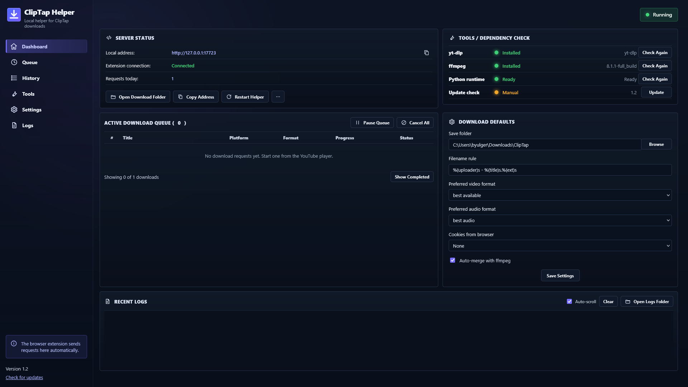
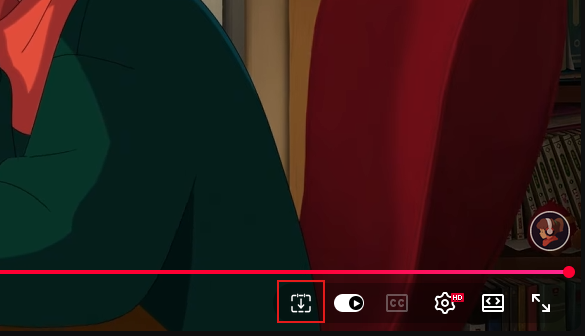
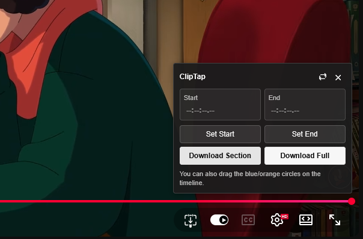
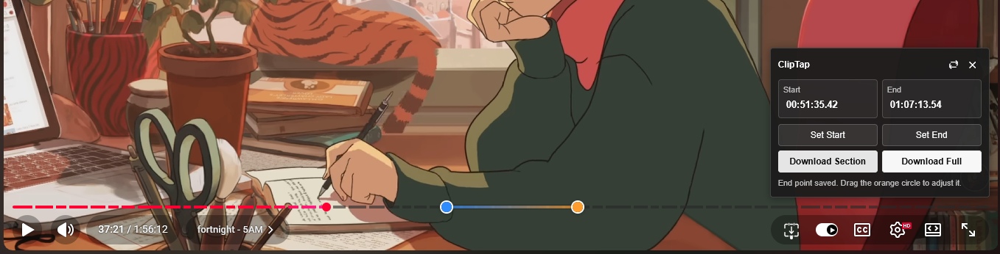
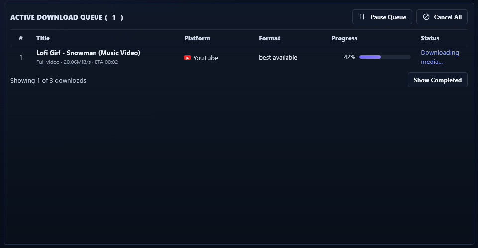
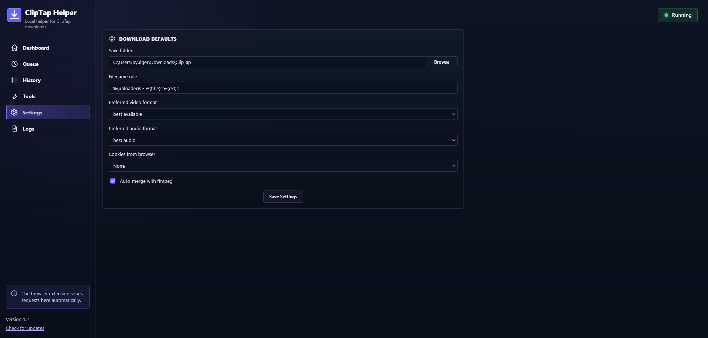
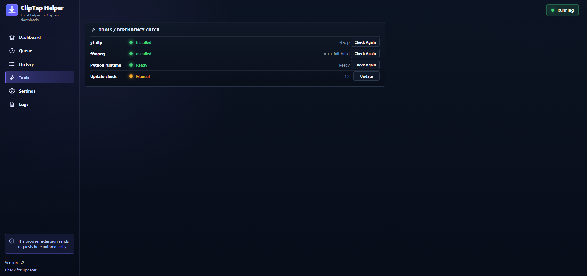
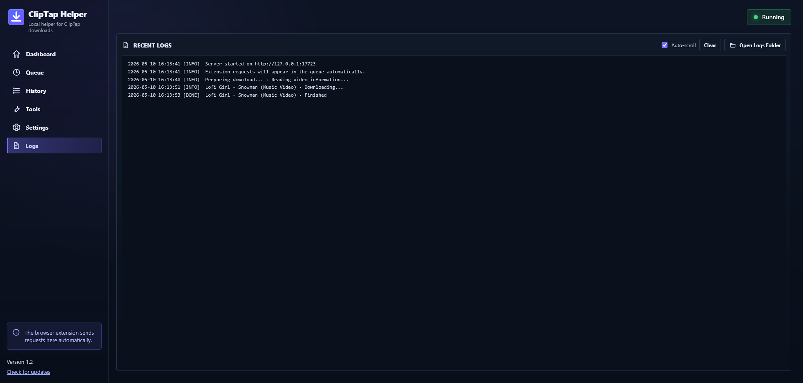
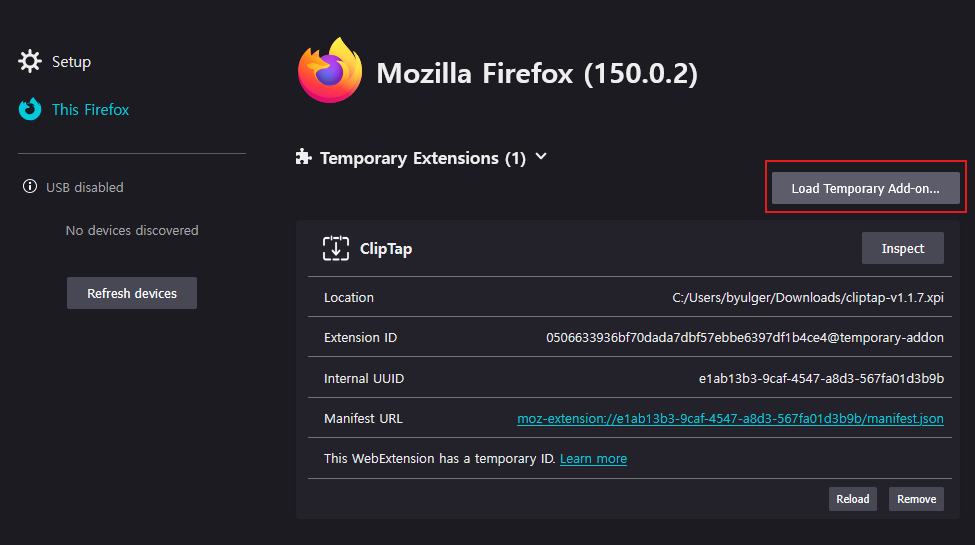

# ClipTap

ClipTap is a browser extension and local helper for downloading selected sections or full videos from YouTube with `yt-dlp`.

The extension adds clipping controls directly inside the YouTube player. The local ClipTap Helper runs on your computer, receives download requests from the extension, checks dependencies, shows download progress, and manages queue/settings/logs through a Web UI dashboard.



## Features

### ClipTap browser extension

- Adds a ClipTap button directly to the YouTube player controls
- Sets a start point and end point from the current playback position
- Shows draggable start/end handles on the YouTube progress bar
- Supports precise timestamp input, including decimal seconds
- Loops the selected range for quick previewing
- Downloads either the selected section or the full video







### ClipTap Helper

- Runs a local manager at `http://127.0.0.1:17723`
- Provides a dark Web UI dashboard
- Shows server status and extension connection status
- Checks `yt-dlp`, FFmpeg, Python runtime, and update status
- Can install/update supported dependencies from the manager
- Displays active download queue with progress, status, format, and platform
- Supports canceling active requests
- Shows live-stream downloads as active recording instead of fixed percentage
- Stores download defaults such as save folder, filename rule, format, audio format, cookies, and FFmpeg merge option
- Shows recent logs inside the manager





## How ClipTap works

ClipTap has two parts:

```text
YouTube player
→ ClipTap browser extension
→ ClipTap Helper at http://127.0.0.1:17723
→ yt-dlp / FFmpeg
→ downloaded file
```

The browser extension handles the YouTube player UI. The helper handles local downloading because browser extensions cannot directly run local tools like `yt-dlp` or FFmpeg by themselves.

## Download files

A release normally includes:

```text
cliptap-v1.2-7.zip
cliptap-v1.2-7.xpi
cliptap-v1.2-7-chrome.zip
```

Use them like this:

| File | Use |
|---|---|
| `cliptap-v1.2-7.zip` | Source code and helper build files |
| `cliptap-v1.2-7.xpi` | Firefox extension package |
| `cliptap-v1.2-7-chrome.zip` | Chrome / Edge unpacked extension package |

The exact file names may change by release.

## Quick start

### 1. Start ClipTap Helper

Run:

```text
ClipTapHelper.exe
```

The helper opens the manager in your browser:

```text
http://127.0.0.1:17723
```

Keep the helper running while downloading. The browser extension sends download requests to this local helper.



### 2. Install the browser extension

Install the extension for your browser.

For Firefox, use the `.xpi` file.

For Chrome or Edge, extract the Chrome package and load it as an unpacked extension.

### 3. Open YouTube

Open a YouTube video and click the ClipTap button inside the player controls.

### 4. Select a range

Use **Set Start** and **Set End**, or drag the timeline handles.

Supported timestamp examples:

```text
83
83.5
01:23
01:23.5
00:01:23.5
```

### 5. Download

Click one of the download buttons:

```text
Download Section
Download Full Video
```

The request appears in ClipTap Helper, where progress and logs are shown.



## Installing the extension

### Firefox

Open:

```text
about:debugging#/runtime/this-firefox
```

Then:

1. Click **Load Temporary Add-on**
2. Select the `.xpi` file



### Chrome / Edge

Open:

```text
chrome://extensions
```

or:

```text
edge://extensions
```

Then:

1. Enable **Developer mode**
2. Click **Load unpacked**
3. Select the extracted `cliptap` extension folder


## ClipTap Helper pages

### Dashboard

The dashboard shows the main server status, dependency status, active queue, download defaults, and recent logs in one place.


### Queue

The queue page focuses on active and completed download requests.

It shows:

- title
- platform
- format
- progress
- status
- cancel controls when available


### History

The history page is prepared for completed download history.


### Tools

The tools page checks local dependencies and helper status.


### Settings

The settings page controls download defaults.


### Logs

The logs page shows helper messages and download output.


## Dependencies

### yt-dlp

ClipTap uses `yt-dlp` for extraction and downloading.

The standalone helper build is designed to include `yt-dlp` support. If you run from source and `yt-dlp` is missing, install it with:

```powershell
py -m pip install -U yt-dlp
```

### FFmpeg

FFmpeg is required for merging video/audio and section cutting.

Install it from ClipTap Helper when available, or manually with:

```powershell
winget install -e --id Gyan.FFmpeg
```

If FFmpeg is not available through `PATH`, place `ffmpeg.exe` next to the helper executable or in:

```text
bin/ffmpeg.exe
```

## Run from source

Install Python, then run:

```powershell
cd cliptap
py helper\ClipTapHelper.py
```

The manager will open at:

```text
http://127.0.0.1:17723
```

## Build the standalone helper

On Windows:

```powershell
cd helper
.\build-standalone.ps1
```

The built executable is created in:

```text
dist/ClipTapHelper.exe
```

A GitHub Actions workflow is also included for building the helper on Windows.

## Project structure

```text
cliptap/
  .github/
    workflows/
      build-helper.yml

  docs/
    images/

  extension/
    manifest.json
    content.js
    popup.html
    popup.css
    popup.js
    icons/
      cliptap.png

  helper/
    ClipTapHelper.py
    build-standalone.ps1
    start-helper.bat
    start-helper.ps1
    assets/
      ClipTapHelper.png
      ClipTapHelper.ico
    bin/
      .gitkeep

  scripts/
    package.sh

  CHANGELOG.md
  LICENSE
  README.md
```

## Troubleshooting

### ClipTap says the helper is not running

Open the manager URL manually:

```text
http://127.0.0.1:17723
```

If it does not open, start `ClipTapHelper.exe` again.

### Save folder keeps showing Loading

Use the latest helper build. Older versions had a settings display issue where the save folder input could stay stuck on `Loading...`.

### yt-dlp is detected but download fails

Use the latest helper build. Older versions could fail with a Python import error involving `yt_dlp.__main__`.

### FFmpeg is missing

Install FFmpeg and restart ClipTap Helper:

```powershell
winget install -e --id Gyan.FFmpeg
```

### The extension button appears, but downloads do not start

Check:

1. ClipTap Helper is running
2. The manager page opens at `http://127.0.0.1:17723`
3. FFmpeg is installed
4. The video is accessible in the browser
5. The Recent Logs panel does not show a dependency or permission error

## Notes

ClipTap is intended for videos you have permission to download or archive. Respect the terms of the websites you use and the rights of content owners.

## License

This project is licensed under the terms included in `LICENSE`.
