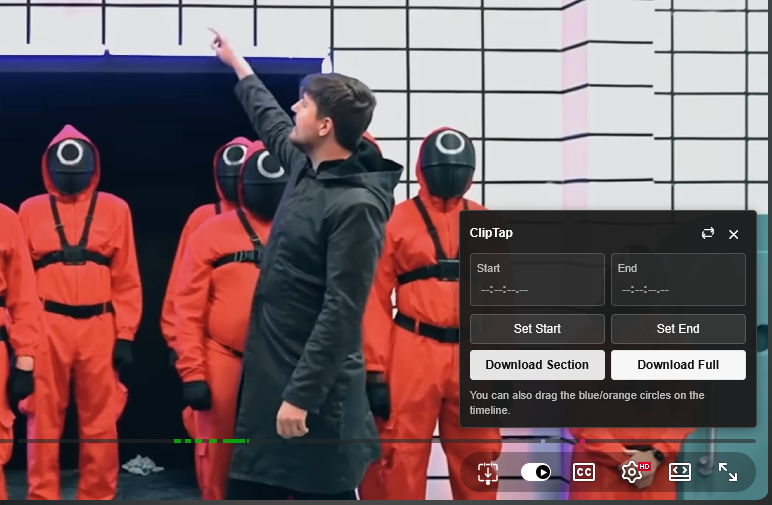
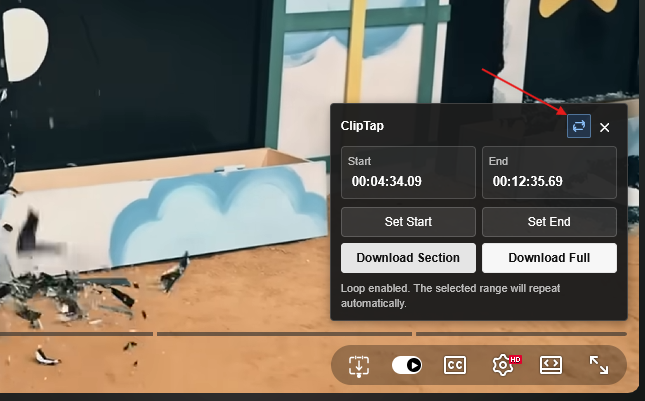

# ClipTap

ClipTap is a browser extension for downloading either a selected section or the full version of a YouTube video using `yt-dlp`.

<<<<<<< HEAD
It adds a small control directly inside the YouTube player, so the start point, end point, loop toggle, and download actions stay close to the video.


=======
It adds controls directly inside the YouTube player and uses a local Web UI manager for dependency checks, download progress, cancellation, and live-stream recording status.


>>>>>>> 8059d7f (feat: add standalone web manager build)
## Features

- Mark a start point and end point from the current playback position
- Drag blue/orange timeline handles directly on the YouTube progress bar
- Type exact timestamps, including decimal seconds
- Loop the selected range while checking the clip
- Download only the selected range
- Download the full video
<<<<<<< HEAD
- Use a standalone Windows helper app instead of a terminal window
- Check and install `yt-dlp` / FFmpeg from the helper app
=======
- Manage downloads from a local Web UI
- Check and install FFmpeg from the manager
- Use bundled `yt-dlp` when the helper is built as a standalone executable
>>>>>>> 8059d7f (feat: add standalone web manager build)
- View incoming download requests with title, thumbnail, status, progress, and cancel controls
- Show live-stream downloads as an active recording instead of a fixed percentage



<<<<<<< HEAD

## How it works

ClipTap has two parts:

1. **Browser extension**  
   Adds ClipTap controls to YouTube and sends download requests.

2. **ClipTap Helper**  
   A local Windows app that receives requests from the extension and runs `yt-dlp` / FFmpeg.

The browser extension cannot directly run local programs, so the helper app must be open while downloading.
=======
## Recommended setup

For normal use, use these two pieces together:

1. `ClipTapHelper.exe`  
   Starts the local manager and opens the Web UI automatically.

2. Browser extension  
   Installs ClipTap into Firefox, Chrome, or Edge.

The helper executable is intentionally separate from the browser extension. Browser extensions cannot directly run local programs such as `yt-dlp` or FFmpeg, so ClipTap needs a local helper running on your computer.
>>>>>>> 8059d7f (feat: add standalone web manager build)

```text
YouTube player
→ ClipTap extension
<<<<<<< HEAD
→ ClipTap Helper at http://127.0.0.1:17723
=======
→ ClipTap Manager at http://127.0.0.1:17723
>>>>>>> 8059d7f (feat: add standalone web manager build)
→ yt-dlp / FFmpeg
→ downloaded file
```

<<<<<<< HEAD
## Requirements

- Windows
- Firefox, Chrome, Edge, or another Chromium-based browser
- Python, only if you are running from source or building the helper app yourself
- `yt-dlp`
- FFmpeg

The helper app can check whether `yt-dlp` and FFmpeg are available. If they are missing, it shows install buttons.


## Install ClipTap Helper

Download and run:
=======
## ClipTap Manager

Run:
>>>>>>> 8059d7f (feat: add standalone web manager build)

```text
ClipTapHelper.exe
```

<<<<<<< HEAD
Keep the helper app open while using ClipTap. The browser extension sends download requests to the helper at:
=======
The manager opens in your default browser:
>>>>>>> 8059d7f (feat: add standalone web manager build)

```text
http://127.0.0.1:17723
```

<<<<<<< HEAD
If `yt-dlp` is missing, click:

```text
Install / Update yt-dlp
```

If FFmpeg is missing, click:
=======
Keep the manager running while using ClipTap. Use **Stop manager** in the Web UI when you want to shut it down.


## Dependencies

### yt-dlp

When `ClipTapHelper.exe` is built with the included build script, `yt-dlp` is bundled into the helper. Users do not need to install `yt-dlp` separately for the normal standalone build.

If you run ClipTap from source, install `yt-dlp` manually:

```powershell
py -m pip install -U yt-dlp
```

### FFmpeg

FFmpeg is still required for merging video/audio and cutting sections.

If FFmpeg is missing, open ClipTap Manager and click:
>>>>>>> 8059d7f (feat: add standalone web manager build)

```text
Install FFmpeg with winget
```

<<<<<<< HEAD
After installing FFmpeg, restart ClipTap Helper if it still appears as missing.


=======
You can also install it manually:

```powershell
winget install -e --id Gyan.FFmpeg
```

If FFmpeg is not available globally, place `ffmpeg.exe` next to `ClipTapHelper.exe` or in a `bin` folder beside it:

```text
bin/ffmpeg.exe
```
>>>>>>> 8059d7f (feat: add standalone web manager build)

## Install the browser extension

### Firefox

Open:

```text
about:debugging#/runtime/this-firefox
```

Choose:

```text
Load Temporary Add-on
```

Then select the `.xpi` file.


<<<<<<< HEAD

=======
>>>>>>> 8059d7f (feat: add standalone web manager build)
### Chrome / Edge

Open:

```text
chrome://extensions
```

or:

```text
edge://extensions
```

Then:

1. Enable **Developer mode**
2. Click **Load unpacked**
3. Select the `cliptap` extension folder


<<<<<<< HEAD

=======
>>>>>>> 8059d7f (feat: add standalone web manager build)
## Using ClipTap

### Open ClipTap

Open a YouTube video and click the ClipTap icon inside the player controls.

### Set the start point

Move the YouTube playback position to the place where the clip should begin, then click:

```text
Set Start
```

<<<<<<< HEAD
=======
The blue start handle appears on the YouTube progress bar.

>>>>>>> 8059d7f (feat: add standalone web manager build)
### Set the end point

Move the playback position to the place where the clip should end, then click:

```text
Set End
```

<<<<<<< HEAD


### Fine-tune the range

Drag the start and end handles directly on the YouTube progress bar.
=======
The orange end handle appears on the YouTube progress bar.


### Fine-tune the range

The start and end handles can be dragged directly on the YouTube progress bar.
>>>>>>> 8059d7f (feat: add standalone web manager build)

When a handle is moved, the video playback position also moves to that timestamp, so the selected point can be checked immediately.

You can also type timestamps manually.

Supported timestamp examples:

```text
83
83.5
01:23
01:23.5
00:01:23.5
```

### Loop the selected range

Turn on the loop button to repeatedly play the selected start-to-end range.

<<<<<<< HEAD


=======
This is useful when checking whether the clip starts and ends at the right moment.


>>>>>>> 8059d7f (feat: add standalone web manager build)

### Download the selected range

Click:

```text
Download Section
```

<<<<<<< HEAD
The helper app will show the request, video title, thumbnail, and progress.
=======
ClipTap sends the selected start and end timestamps to the manager. The request appears in the Web UI with progress and a cancel button.


>>>>>>> 8059d7f (feat: add standalone web manager build)

### Download the full video

Click:

```text
<<<<<<< HEAD
Download Full
```

For normal videos, the helper shows a percentage progress bar.

For live streams, the helper shows an active recording state because there is no fixed final size while the stream is still running.


## Build ClipTapHelper.exe from source

From PowerShell:

```powershell
cd cliptap\helper
.\build-helper-exe.ps1
```

The build script creates:

```text
cliptap/dist/ClipTapHelper.exe
```

=======
Download Full Video
```

This downloads the full video without applying the selected start and end range.

For live streams, full download mode records until the stream ends or until the request is cancelled. The manager shows this as an active recording instead of a normal percentage progress bar.

## Build the standalone helper

The helper source is a single file:

```text
helper/ClipTapHelper.py
```

To build the one-file Windows helper executable:

```powershell
cd helper
.\build-standalone.ps1
```

The output is:

```text
dist/ClipTapHelper.exe
```

The repository also includes a GitHub Actions workflow:

```text
.github/workflows/build-helper.yml
```

Run the workflow from GitHub to build `ClipTapHelper.exe` on `windows-latest` and download it as an artifact.

## Run from source

For development, run:

```text
helper/start-helper.bat
```

This starts the same manager using Python and opens:

```text
http://127.0.0.1:17723
```

## Troubleshooting

### “Helper is off or an error occurred”

Open the manager:

```text
http://127.0.0.1:17723
```

If the page does not open, run `ClipTapHelper.exe` again.

### The manager says FFmpeg is missing

Use the manager install button, or run:

```powershell
winget install -e --id Gyan.FFmpeg
```

If FFmpeg is not available globally, place `ffmpeg.exe` here beside the helper executable:

```text
bin/ffmpeg.exe
```

### Download requests appear but fail

Check the failed request in ClipTap Manager. Common causes are:

1. FFmpeg is missing
2. `yt-dlp` is outdated
3. The video requires browser cookies
4. The video URL is unavailable
5. YouTube changed its response format and `yt-dlp` needs an update

>>>>>>> 8059d7f (feat: add standalone web manager build)
## Project structure

```text
cliptap/
  extension/
    manifest.json
    popup.html
    popup.css
    popup.js
    content.js
    icons/
      cliptap.png

  helper/
<<<<<<< HEAD
    ClipTapHelper.pyw
    build-helper-exe.ps1
    requirements.txt
    bin/
      ffmpeg.exe
=======
    ClipTapHelper.py
    build-standalone.ps1
    start-helper.bat
    start-helper.ps1
    assets/
      ClipTapHelper.png
      ClipTapHelper.ico
    bin/
      .gitkeep

  .github/
    workflows/
      build-helper.yml
>>>>>>> 8059d7f (feat: add standalone web manager build)

  scripts/
    package.sh

  README.md
  CHANGELOG.md
  LICENSE
```

<<<<<<< HEAD
## Troubleshooting

### The extension says the helper is off or an error occurred

Open ClipTap Helper and check that the server status says:

```text
Server: running at http://127.0.0.1:17723
```

You can also open this URL in your browser:

```text
http://127.0.0.1:17723/health
```

### yt-dlp is missing

Click **Install / Update yt-dlp** in ClipTap Helper.

Or install it manually:

```powershell
py -m pip install -U yt-dlp
```

### FFmpeg is missing

Click **Install FFmpeg** in ClipTap Helper.

Or install it manually:

```powershell
winget install -e --id Gyan.FFmpeg
```

If FFmpeg still is not detected, place `ffmpeg.exe` here:

```text
cliptap/helper/bin/ffmpeg.exe
```

### A download is wrong or no progress appears

Some streams do not report progress in a normal percentage format. Live streams are shown as active recordings and can be cancelled from the helper window.

=======
>>>>>>> 8059d7f (feat: add standalone web manager build)
## Notes

ClipTap uses `yt-dlp` for downloading and FFmpeg for media processing. Use ClipTap only with videos that you have the right to download or archive.

## License

This project is licensed under the terms included in `LICENSE`.
