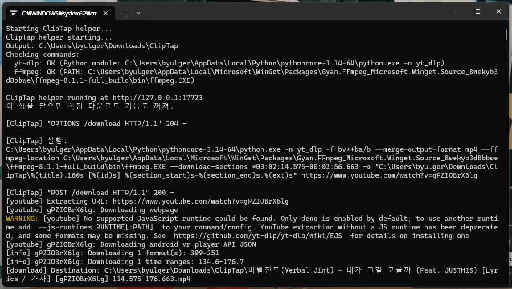

# ClipTap

ClipTap is a browser extension for downloading either a selected section or the full version of a YouTube video using `yt-dlp`.

It adds a small control directly inside the YouTube player, so the start point, end point, loop toggle, and download actions stay close to the video instead of floating somewhere else on the page.


## What ClipTap does

ClipTap helps you mark a precise part of a YouTube video and download only that range.

You can:

- set a start point from the current playback position
- set an end point from the current playback position
- drag the start and end handles directly on the YouTube progress bar
- type exact timestamps, including decimal seconds
- loop the selected range while checking the clip
- download the selected range
- download the full video


## How it works

ClipTap is split into two parts:

1. **Browser extension**  
   Adds the ClipTap controls to YouTube and sends download requests.

2. **Local helper**  
   Runs on your computer and executes `yt-dlp`.

The browser extension cannot directly run local programs such as `yt-dlp` or `ffmpeg`, so the helper must be running while downloading.

```text
YouTube player
→ ClipTap extension
→ local helper at http://127.0.0.1:17723
→ yt-dlp / ffmpeg
→ downloaded file
```

## Requirements

Before using ClipTap, install:

- Python
- yt-dlp
- FFmpeg
- Firefox or a Chromium-based browser

### Install yt-dlp

```powershell
py -m pip install -U yt-dlp
```

ClipTap can use `python -m yt_dlp` when the `yt-dlp` command is not available globally.

### Install FFmpeg

On Windows, the easiest option is:

```powershell
winget install -e --id Gyan.FFmpeg
```

After installation, open a new terminal and check:

```powershell
ffmpeg -version
```

If `ffmpeg` is not available globally, place `ffmpeg.exe` here:

```text
cliptap/helper/bin/ffmpeg.exe
```

## Installation

### 1. Start the helper

Run:

```text
cliptap/helper/start-helper.bat
```

The helper window should show something like:

```text
ClipTap helper running at http://127.0.0.1:17723
```

Keep this window open while using ClipTap. Closing it will stop the download feature.



### 2. Install in Firefox

Open:

```text
about:debugging#/runtime/this-firefox
```

Then choose:

```text
Load Temporary Add-on
```

Select the `.xpi` file, or select `manifest.json` inside the extension folder when loading from source.


### 3. Install in Chrome or Edge

Open:

```text
chrome://extensions
```

or:

```text
edge://extensions
```

Then:

1. Enable **Developer mode**
2. Click **Load unpacked**
3. Select the `cliptap` extension folder

## Using ClipTap

### Open ClipTap

Open a YouTube video and click the ClipTap icon inside the player controls.

The ClipTap panel appears inside the player, close to the video controls.

### Set the start point

Move the YouTube playback position to the place where the clip should begin, then click:

```text
Set Start
```

The start handle appears on the YouTube progress bar.

### Set the end point

Move the playback position to the place where the clip should end, then click:

```text
Set End
```

The end handle appears on the YouTube progress bar.


### Fine-tune the range

The start and end handles can be dragged directly on the YouTube progress bar.

When a handle is moved, the video playback position also moves to that timestamp, so the selected point can be checked immediately.

You can also type timestamps manually.

Supported timestamp examples:

```text
83
83.5
01:23
01:23.5
00:01:23.5
```

### Loop the selected range

Turn on the loop button to repeatedly play the selected start-to-end range.

This is useful when checking whether the clip starts and ends at the right moment.


### Download the selected range

Click:

```text
Download Section
```

ClipTap sends the selected start and end timestamps to the helper, and the helper runs `yt-dlp` with a section download option.

### Download the full video

Click:

```text
Download Full Video
```

This downloads the full video without applying the selected start and end range.

## Troubleshooting

### “Helper is not running or an error occurred”

Check that the helper window is still open.

Open this URL in your browser:

```text
http://127.0.0.1:17723/health
```

If the helper is running, it should respond successfully.

### The helper says yt-dlp is not found

Run:

```powershell
py -m pip install -U yt-dlp
```

Then restart the helper.

ClipTap can fall back to:

```powershell
py -m yt_dlp
```

when the global `yt-dlp` command is unavailable.

### The helper says ffmpeg is not found

Install FFmpeg:

```powershell
winget install -e --id Gyan.FFmpeg
```

Then open a new terminal and run:

```powershell
ffmpeg -version
```

If the command still does not work, place `ffmpeg.exe` here:

```text
cliptap/helper/bin/ffmpeg.exe
```

### YouTube freezes or becomes slow

Make sure you are using the latest ClipTap build.

Older builds used heavier page observation logic. Newer versions avoid watching the full YouTube page continuously.

### The extension icon appears, but downloading fails

The extension UI can load even when the helper is not ready.

Check:

1. The helper window is open
2. `yt-dlp` is installed
3. `ffmpeg` is installed
4. The video URL is accessible
5. The terminal does not show a Python error

## Project structure

```text
cliptap/
  extension/
    manifest.json
    popup.html
    popup.css
    popup.js
    content.js
    icons/
      cliptap.png

  helper/
    server.py
    start-helper.bat
    start-helper.ps1
    bin/
      ffmpeg.exe

  scripts/
    package.sh

  README.md
  CHANGELOG.md
  LICENSE
```

## Notes

ClipTap uses `yt-dlp` for downloading and FFmpeg for media processing. Use ClipTap only with videos that you have the right to download or archive.

## License

This project is licensed under the terms included in `LICENSE`.
